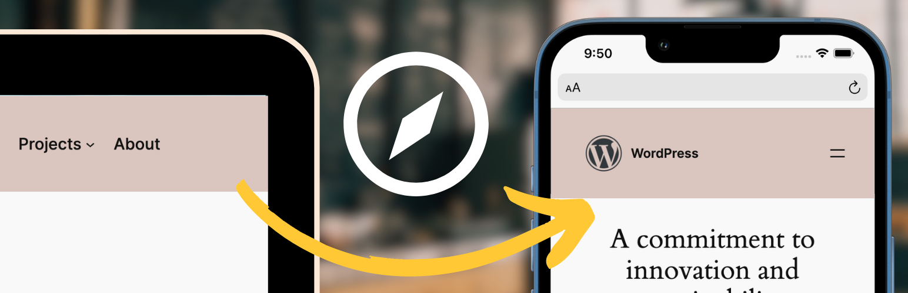

# Responsive Navigation Block

-   Stable tag: 1.0.4
-   Tested up to: 6.6
-   License: GPL-2.0-or-later
-   Tags: navigation, menus, responsive, blocks
-   Contributors: [get_dave](https://profiles.wordpress.org/get_dave/)
-   Source code: https://github.com/getdave/responsive-navigation-block

Complete control over your navigation menus based on screen size including styles and menu items.

## Description

This Plugin allows you to display and apply alternative styling to different navigation menus based on the screen size using the WordPress Navigation block.

### Features

-   Style your menu differently depending on screen size.
-   Use a different menu for each screen size.
-   Customize the "breakpoint" (where you switch between mobile and desktop).
-   Automatically switch editor to "mobile" preview when editing the mobile navigation.

### Usage

This Plugin creates two block variations from the Navigation block which will be automatically hidden/shown at the configured breakpoint (screensize)

This affords the ability to independently style mobile vs desktop navigation and even allows for completely different menus to be used.

The Plugin should be used as follows:

-   Install and Activate the plugin - two new block variations will be automatically registered for "Mobile" and "Desktop".
-   Go to the Editor and remove any existing Navigation block.
-   Add the "Desktop Navigation" block - style and configure the menu for "desktop" as required.
-   Add the "Mobile Navigation" block - style and configure the menu for "mobile" as required.
-   View the front of your website and resize your browser to see the navigations swap out at the appropriate breakpoint/screensize.

### Support

Please see FAQs. If you still have an issue please:

-   check [Github for existing Issue reports](https://github.com/getdave/responsive-navigation-block/issues).
-   (if none) then file a new Issue on Github

### Privacy Statement

Responsive Navigation does _not_:

-   use cookies.
-   send data to any third party.
-   include any third party resources.

## Frequently Asked Questions

### Why is this plugin necessary?

The built in WordPress Navigation block provides limited control over its display on smaller screens. Whilst [efforts are underway to implement solutions to this natively within WordPress](https://github.com/WordPress/gutenberg/issues/43852#issuecomment-1884949063) they are currently still in development.

Until a solution arrives in WordPress Core, this Plugin exists to provide a workaround solution that requires minimal user configuration.

This Plugin was based upon a technique which I originally documented in my [YouTube Video: Use a different MENU on MOBILE with the Navigation block in WORDPRESS block editor](https://www.youtube.com/watch?v=dY3f8sHcAPA).

### Can I adjust the breakpoint?

By default, the "breakpoint" at which the mobile navigation will switch to show the desktop navigation is `782px`. This aligns with the default configuration of the built in Wordpress Navigation block. To change this you can:

-   Go to the WP Admin Dashboard.
-   Go to `Settings -> Responsive Navigation`.
-   Configure the breakpoint value and the required unit. Save.
-   The breakpoint will be adjusted to match your new configuration.

Note that you can use relative units such as `em`, `rem` and `vw`.

### Styling of my mobile menu doesn't work

Due to complications with the way the default WordPress Navigation block works you are advised to use the following settings to control the styling of your mobile navigation:

-   Mobile overlay
    -   background color - `Styles -> Color -> Submenu & overlay background`.
    -   text color - `Styles -> Color -> Submenu & overlay text`.
-   Mobile menu toggle button ("hamburger"):
    -   icon color - `Styles -> Color -> Text`.
    -   background color - `Styles -> Color -> Text`.

Styles for Desktop Navigation can be applied using the standard controls.

## Contributing

Contributions to this Plugin are welcome. Please fork the Github repository and submit a PR for review.

### Development Setup

This Plugin uses the [@wordpress/scripts package](https://developer.wordpress.org/block-editor/reference-guides/packages/packages-scripts/).

-   Check out the Github repo into the `wp-content/plugins` directory of a WordPress installation.
-   `cd` into the Plugin's directory install the dependencies with `npm i`.
-   Running `npm start` will start the `@wordpress/scripts` package in watch mode ready to compile the JavaScript on modification.
-   PHP files can be edited in the usual manner.

### Testing

The Plugin has e2e test coverage for the key features courtesey of @wordpress/scripts and Playwright.

To run the tests - in your terminal of choice:

-   `npm run build`.
-   `npm run wp-env start`.
-   Run the tests: `npm run test:e2e`

### Releasing

Releasing the Plugin is the prerogative of the Plugin owner (@get_dave). The process is as follows:

-   Commit all changes to `trunk` branch.
-   TBC

## Changelog

### 1.0.4

Initial version.
